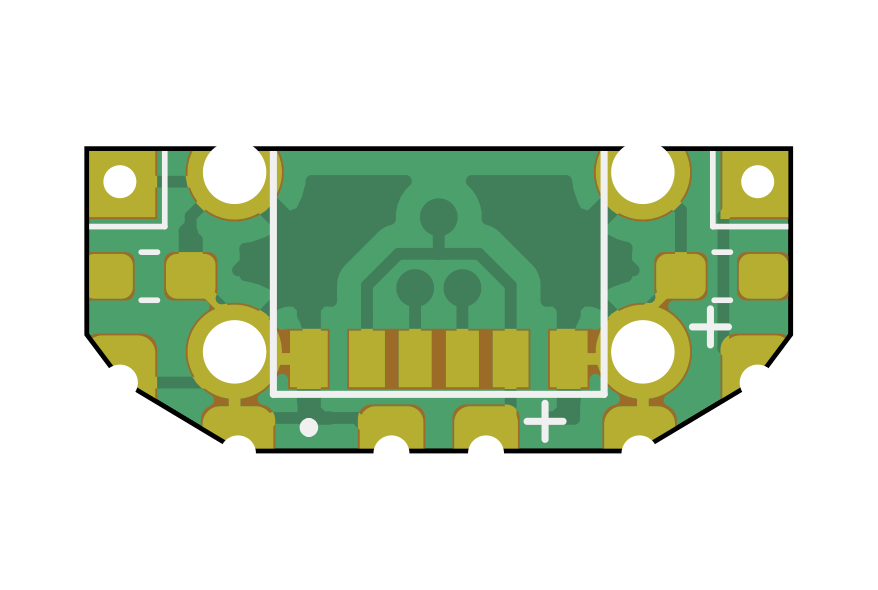
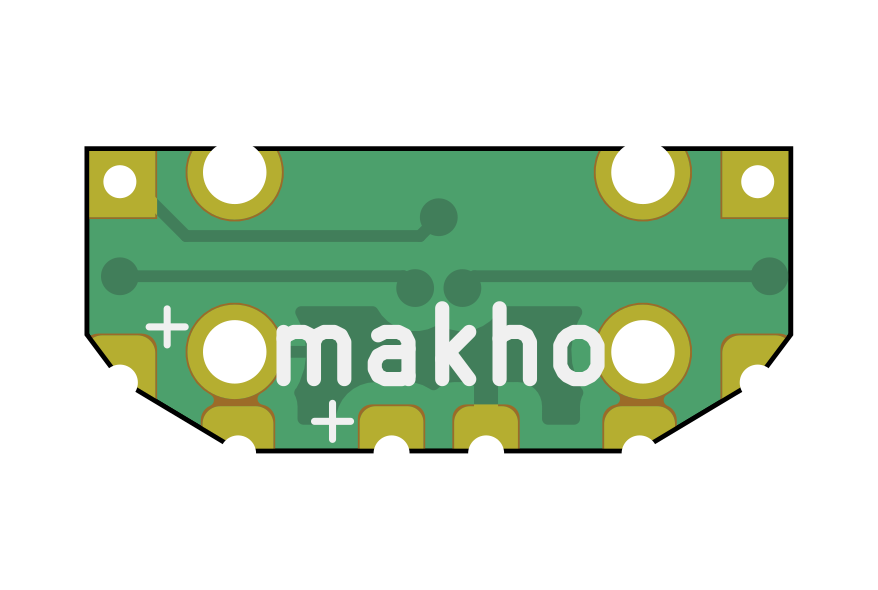

# 3DS_C
USB Type C conversion board for original 3DS consoles

INSTALL AT YOUR OWN RISK!

These worked perfectly fine for me but I have had several reports of blown fuses. The parts are extremely close together and at very high risk of short with improper handling or install. Consider omitting the pads for the dock charger. The wider USB C port makes clearance very tight and without proper insulation, the pad WILL short on the body (ground) of the port. Again, it worked for me but it's really tight. 

Also, hi r/tsg and r/3d shacks

---

You can order some boards [from ohspark here](https://oshpark.com/shared_projects/H7cVX6ow) or use the supplied gerber file zip to upload to your preferred fab (does use castellated holes). I tested this successfully with 0.8mm PCBs

Otherwise all you need are the USB Type C ports: https://www.aliexpress.com/item/32885941456.html

And two optional (for Type C Host charging only) 5.1k 0603 resistors. 

For install, you will need to completely desolder the original port and file out the opening with needle files as the type C port is bigger than the OEM charge port. Solder the port to the new board, solder the optional resistors, then solder the board to the 3DS. I have also included pads to transplant the original pads for the dock charger but due to the size of the type C port, it's not recommended. See my install below for more info or better instruction. 

YouTube install: https://www.youtube.com/watch?v=8TaaZng31x4

